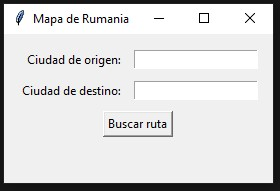
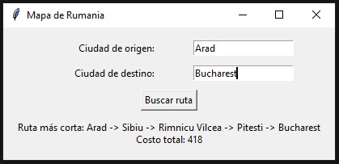
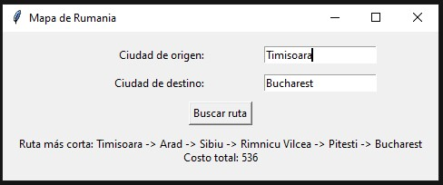
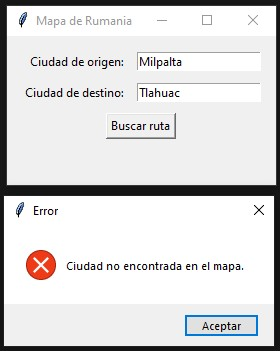
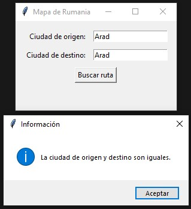

# Romania Shortest Path Finder using NetworkX

A Python application that models the classic **Romania road map** as a weighted graph and finds the **minimum-cost route** between two cities using **Dijkstra's shortest path algorithm**, accessed through the NetworkX library. The project includes a graphical user interface (GUI) built with Tkinter, allowing users to search for optimal routes interactively.

This project demonstrates practical applications of **Artificial Intelligence search techniques**, **graph theory**, and **weighted graph algorithms**, making it suitable for courses in Artificial Intelligence, Data Structures, Graph Theory, and Algorithm Design.

---

## Features

- Representation of the Romania road map as a weighted graph.
- Interactive graphical interface using Tkinter.
- Shortest path computation using NetworkX.
- Automatic calculation of total travel cost.
- Validation of invalid city names.
- Validation when origin and destination are identical.
- Clean and easy-to-understand Python implementation.

---

## Artificial Intelligence Context

Although this project uses the **NetworkX** library, the underlying algorithm corresponds to one of the classical **informed search methods** used in Artificial Intelligence.

Specifically, `networkx.shortest_path(..., weight="weight")` solves the problem using **Dijkstra's algorithm** (for graphs with non-negative edge weights), which is one of the fundamental graph search algorithms frequently studied in AI before introducing heuristic search methods such as **Greedy Best-First Search** and **A\***.

The application therefore demonstrates:

- Intelligent path planning
- State-space search
- Weighted graph traversal
- Optimal path computation
- Cost minimization

Unlike uninformed searches such as Breadth-First Search (BFS) or Depth-First Search (DFS), Dijkstra expands nodes according to the accumulated path cost, guaranteeing the optimal solution when all edge weights are non-negative.

---

## Technologies Used

- Python 3
- NetworkX
- Tkinter

---

## Repository Structure

```
Romania-Shortest-Path-Finder-NetworkX/
│
├── src/
│   └── romania_shortest_path.py
│
├── assets/
│   └── images/
│       ├── interface.jpg
│       ├── route_arad_bucharest.jpg
│       ├── route_timisoara_bucharest.jpg
│       ├── invalid_city.jpg
│       └── same_origin_destination.jpg
│
├── LICENSE
├── .gitignore
└── README.md
```

---

## Graph Model

Each city is represented as a graph node.

Each road is represented as an edge with an associated travel cost.

Example:

```
Arad --------140-------- Sibiu
 |                           |
118                        80
 |                           |
Timisoara               Rimnicu Vilcea
```

The shortest route is computed by minimizing the total accumulated distance.

---

## How It Works

1. The Romania map is modeled as a weighted graph.
2. The user enters an origin city.
3. The user enters a destination city.
4. The application validates both cities.
5. NetworkX computes the optimal route using Dijkstra's algorithm.
6. The complete path and total cost are displayed.

---

# Screenshots

## Application Interface

The main graphical interface where the user enters the origin and destination cities.



---

## Route Search (Arad → Bucharest)

Example of the optimal route obtained from Arad to Bucharest, including the minimum total travel cost.



---

## Route Search (Timisoara → Bucharest)

Another shortest-path example using a different origin city.



---

## Invalid City Validation

The application detects when a city does not exist in the Romania map.



---

## Same Origin and Destination

Validation message displayed when the origin and destination cities are identical.



---

## Example

Input

```
Origin:
Arad

Destination:
Bucharest
```

Output

```
Shortest Path

Arad
↓
Sibiu
↓
Rimnicu Vilcea
↓
Pitesti
↓
Bucharest

Total Cost: 418
```

---

## Applications

This project can be used for studying:

- Artificial Intelligence
- Intelligent Search Algorithms
- Graph Theory
- Weighted Graphs
- Shortest Path Problems
- Route Planning
- Python GUI Development
- Network Modeling
- Data Structures
- Algorithm Design

---

## Future Improvements

- Interactive visualization of the graph.
- Highlight the computed path directly on the map.
- Animated traversal of the selected route.
- Support for A* Search.
- Greedy Best-First Search implementation.
- Uniform Cost Search implementation.
- Custom graph loading from external files.
- Visualization using Matplotlib.

---

## License

This project is distributed under the MIT License.

---

## Author

**Jose Luis Alva Salazar**

Computer Systems Engineer

GitHub: **LuisAlva**
